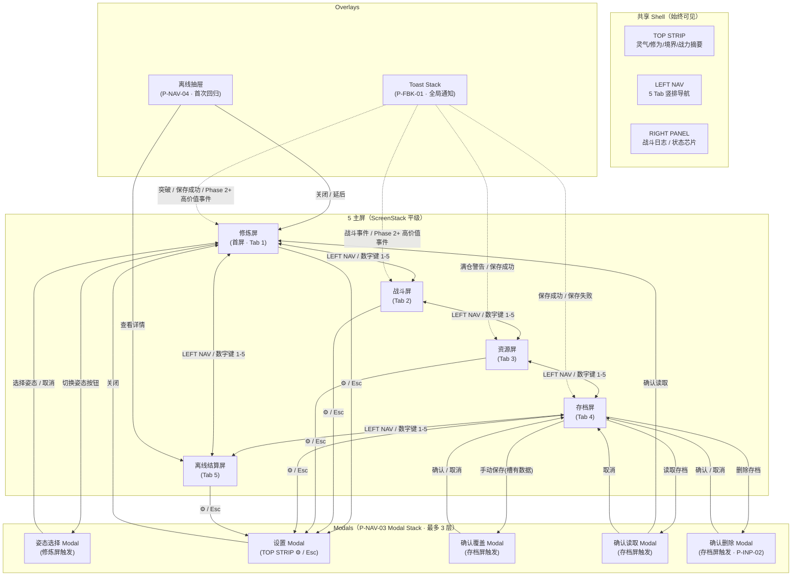

# screen-flow.md — MVP 屏幕导航拓扑与渐进 UI 节奏

> 版本：v1.0
> 最后更新：2026-05-05
> 关联文档：`design/gdd/game-concept.md`（§4.6 渐进叙事展开、§4.8 自动化是成长奖励、§11 MVP 定义）、`design/narrative/world-skeleton.md`（§6 渐进叙事展开设计）、`design/ux/interaction-patterns.md`（交互模式库）、`design/gdd/ui-framework.md`（UI 框架 GDD）、`design/ux/visual-design-sprint-11.md`（§0 设计原则、§1 共享 Shell 设计）、`design/ux/cultivation-screen.md`、`design/ux/combat-screen.md`、`design/ux/resources-screen.md`、`design/ux/save-screen.md`、`design/ux/offline-settlement-screen.md`
> 范围：MVP（阶段 1）— 5 主屏 + 共享 Shell + Modals + Toast

---

## 1. 设计目标与支柱锚定

本文件定义 MVP 所有 UI 屏幕之间的导航拓扑、解锁触发条件、渐进 UI 展开节奏。核心目标是落实 game-concept.md §4.6 的核心承诺：

> "开局只给'修炼'。系统逐步出现，世界逐步展开。玩家不是进入一个菜单地狱，而是发现一个越来越大的修仙世界。"

### 1.1 三大导航原则

| # | 原则 | 来源 | 说明 |
|---|------|------|------|
| P1 | **先行为，后界面** | world-skeleton §6.3 | 玩家先用最简方式体验系统核心行为，再获得完整 UI |
| P2 | **境界是叙事门禁** | world-skeleton §6.3、game-concept §4.6 | 所有重大 UI 解锁以境界突破为锚点，让境界不仅是一个数字 |
| P3 | **一个系统 = 一个叙事理由** | world-skeleton §6.3 | 每个新 UI 解锁时给出"为什么现在才出现"的世界观解释 |

### 1.2 支柱锚定

| 支柱 | 本文件如何落实 |
|------|--------------|
| 4.2 放置 = 低频高价值决策 | 5 主屏平级切换（无深层嵌套菜单），每屏承载一类决策 |
| 4.6 渐进叙事展开 | §3 解锁序列精确控制每屏/每 tab/每 UI 元素的出现时机 |
| 4.8 自动化是成长奖励 | 离线结算屏、背包容量警告、连败自动暂停等 UI 反馈随进度解锁 |
| 4.10 数据驱动与可扩展 | 225 系统蓝图的所有未来屏幕在 §8 中预留扩展点 |

---

## 2. 屏幕导航拓扑

### 2.1 Mermaid 全览图



### 2.2 导航规则总结

| 规则 | 说明 |
|------|------|
| **5 主屏平级切换** | 修炼 / 战斗 / 资源 / 存档 / 离线结算——全部通过 LEFT NAV 或数字键 1-5 互相直达。无层级嵌套，无"返回上一级"。 |
| **Modal 浮层叠加** | 姿态选择、设置、存档确认三类 modal 通过 P-NAV-03 Modal Stack 浮层叠加，不替换底层屏幕。关闭 modal 后回到触发屏。 |
| **离线抽屉不等于离线屏** | 离线抽屉（P-NAV-04）是首次回归时弹出的**速览浮层**；离线结算屏是**全屏深度报告**。抽屉中的"查看详情"通向离线屏。 |
| **无"返回"按钮** | 5 主屏之间没有层级关系，因此无"返回上一屏"按钮。只有 ScreenStack 的平级切换。唯一例外是离线结算屏的"延后查看"按钮——回到 drawer 触发前所在的屏（`UIManager.previous_screen`）。 |
| **ESC 行为** | 无 modal 时按 Esc 打开设置 modal（不是退出当前屏）。modal 打开时按 Esc 关闭 modal。 |

### 2.3 Modal 触发条件总览

| Modal | Pattern | 触发屏 | 触发条件 | 关闭后回到 |
|--------|---------|--------|----------|-----------|
| 姿态选择 | P-NAV-03 | 修炼屏 | 点击"切换姿态"按钮 | 修炼屏 |
| 设置 | P-NAV-03 | 任意屏 | 点击 TOP STRIP ⚙ / 按 Esc（无其他 modal 时） | 触发屏 |
| 确认覆盖 | P-NAV-03 | 存档屏 | 点击"手动保存" + 目标槽已有数据 | 存档屏 |
| 确认读取 | P-NAV-03 | 存档屏 | 点击"读取存档" + 目标槽有数据 | 修炼屏（读取成功后）/ 存档屏（取消） |
| 确认删除 | P-INP-02 | 存档屏 | 点击"删除存档" | 存档屏 |

### 2.4 Toast 触发场景

| 优先级 | 场景 | Token | 触发系统 | 消失时间 |
|--------|------|-------|----------|----------|
| **Phase 2+ 高价值掉落** | 后续装备/品质系统启用后获得高价值物品 | `burst_gold` | `loot.rare_drop` 事件（Sprint 12 不触发） | 4s |
| **突破成功**（预留） | 境界突破完成 | `burst_gold` | `realm.breakthrough` 事件（Phase 4+） | 4s |
| **保存成功** | 手动/自动保存完成 | `burst_gold` | `save.saved` 事件 | 4s |
| **保存失败** | 磁盘满/权限错误 | `failure_red` | `save.saved`（含 error） | 8s（延长：玩家需要看清错误原因） |
| **满仓警告** | 任一资源 fill_ratio ≥ 1.0 + 溢出 | `bottleneck_red` | `resource.{id}.overflow` 事件 | 4s |
| **离线收益待查看** | `offline.settled` 完成 | `burst_gold` | `offline.settled` 事件 | 8s 或点击后消失 |
| **离线收益全部损失** | 所有资源 lost == gross | `bottleneck_red` | `offline.settled` + summary 检测 | 8s |
| **连败警告** | 战斗连败 ≥ 5 次后自动暂停 | `bottleneck_red` | SemiAutoCombatSystem recommendation | 直到玩家操作 |

---

## 3. 渐进 UI 解锁序列

### 3.1 解锁序列总表

按玩家首次遇到的时间顺序排列。每个解锁点包含：触发条件、解锁的 UI 元素、叙事理由、设计来源。

| # | 触发条件 | 解锁的 UI 元素 | 叙事理由 | 来源 |
|---|----------|---------------|----------|------|
| **0** | 首次进入游戏（冷启动） | **修炼屏**（仅 meditate 打坐姿态）、**TOP STRIP**（灵气数/修为数）、**LEFT NAV Tab 1**（修炼 · 激活）、**RIGHT PANEL**（空状态） | 对标 A Dark Room 极简开局。你只是一个在青石村外打坐的凡人，世界还没有展开。 | game-concept §4.6、world-skeleton §6.1 |
| **1** | 灵气 ≥ 100（约 2-3 分钟自动积累，或 10 次手动修炼） | **战斗屏**、**LEFT NAV Tab 2**（战斗 · 激活）、**青丘山林（Zone 1）默认解锁** | "体内灵气似乎冲破了什么关窍……你隐约感知到山中有异动。"——灵气作为感知能力的隐喻：灵气够了才能"感知"到山中有妖兽可以战斗。 | world-skeleton §6.1-6.2、cultivation-screen UX §Player Context |
| **2** | 首次战斗掉落（第一件物品获得） | **资源屏**、**LEFT NAV Tab 3**（资源 · 激活） | "你捡起了第一片灵草——这山里的东西，或许比想象的值钱。"——先有物品，再解锁背包查看。遵循"先行为后界面"原则。 | world-skeleton §6.3、resources-screen UX §Player Context |
| **3** | 首次离线回归（离线时长 > 0） | **离线抽屉（P-NAV-04）**、**离线结算屏**、**LEFT NAV Tab 5**（离线 · 激活 + pending 角标） | "闭关归来，洞府中灵气自行汇聚。"——第一次"回来"时看到离线收益的存在。抽屉弹出 = 游戏主动告知"你不在时世界仍在运转"。 | cultivation-screen UX §States、offline-settlement-screen UX §Entry |
| **4** | Lv.5 + atk ≥ 180（约 15-20 分钟） | **幽墟灵谷（Zone 2）解锁**、战斗屏 Zone Selector 显示第 2 个 tab（Zone 2 从 locked 变为 available） | "灵气顺着山势向谷中汇聚，你意识到更深处也许适合历练。"——区域解锁先服务内容推进，境界突破保留为 Lv.10 / Lv.30 的仪式节点。 | world-skeleton §6.2、mvp-content-progression §2.1 |
| **5** | Lv.15 + atk ≥ 1,600（约 2-5 小时，视离线节奏浮动） | **荒殒战场（Zone 3）解锁**、战斗屏 Zone Selector 显示第 3 个 tab 可用 | "谷尽头的焦土上传来金铁幻音——危险，但也藏着大机缘。"——荒殒战场是 Lv.1-30 MVP 的最高区域挑战，不要求金丹期已实装。 | world-skeleton §6.2、mvp-content-progression §2.1 |
| **6** | 首次触发容量警告（任一有上限资源 fill_ratio ≥ 0.85） | 资源屏 fill bar 红色 + "⚠" 字符 + 行背景微红；RIGHT PANEL 警告 chip 出现 | "灵气在体内饱和，若不及时转化，多余的灵息将白白散去。"——容量上限不是惩罚，是引导玩家"该用资源了"。 | resources-screen UX §States、visual-design-sprint-11 §4.1、4.5 |
| **7** | 首次连败 ≥ 5（战斗屏） | 战斗自动暂停 + TEAM STATUS ZONE 旁出 P-FBK-02 chip "建议换区或提升属性" | "连续失利五次——即便是最鲁莽的散修也知道该换条路了。"——失败不是终结，系统主动介入提供建议。 | combat-screen UX §States.Consecutive Failure Threshold |

### 3.2 LEFT NAV 可见性时间线

```
     冷启动        灵气≥100     首次掉落     首次离线回归     Lv.5         Lv.15
       │              │            │             │            │            │
Tab 1  ██████████████████████████████████████████████████████████████████████
       修炼(激活)
       
Tab 2                 ████████████████████████████████████████████████████████
                      战斗(激活)

Tab 3                              ██████████████████████████████████████████
                                    资源(激活)

Tab 4  ? ? ? ? ? ? ? ? ? ? ? ? ? ? ? ? ? ? ? ? ? ? ? ? ? ? ? ? ? ? ? ? ? ? ?
       存档（始终可见+激活 — 自动保存后台运行，手动保存也随时可用）

Tab 5                                              ████████████████████████████
                                                    离线结算(激活 + 🔴角标)
```

### 3.3 存档屏为什么始终可见

存档屏从头到尾可见且激活，原因有三：

1. **自动保存后台运行** — 即使玩家不知道"存档屏"的存在，`SaveManager` 也在每 N 秒自动保存。让存档屏始终可访问，玩家随时可以确认"我的进度被保护着"。
2. **不绑定任何游戏进度解锁条件** — 存档是系统功能，不是游戏内容。"只能在某个境界保存"会破坏玩家对"进度安全"的信任。
3. **极低首次访问压力** — 新玩家在前几分钟不会主动点"存档" tab（他们甚至可能不知道 LEFT NAV 是可交互的），但老玩家或谨慎型玩家可以随时去手动保存。

### 3.4 解锁规则的设计哲学

| 规则 | 说明 | 反例 |
|------|------|------|
| **解锁 = 叙事事件，不是 UI toggle** | 每个解锁点有对应的世界内叙事文本（如"灵气感知到异动"），不凭空弹出菜单。 | 不要在左上角弹"新功能已解锁！战斗系统现已开放"的系统通知（那是菜单地狱的做法）。 |
| **解锁不可逆** | 一旦解锁，UI 元素永久可见/可用，不存在"退回去藏起来"。 | 不要因为玩家的灵气从 100 降到 99（消费后）就隐藏战斗屏。 |
| **灰度预告 > 完全隐藏** | 锁定但玩家已知晓其存在的 UI（如 Zone tabs 中未解锁的区域），显示为锁定的灰度态 + tooltip 告知解锁条件，而非完全不可见。 | Zone Selector 中始终显示 3 个 zone tab——未解锁的显示 🔒 + 灰度 + 解锁条件 tooltip，而非只显示已解锁的 zone。 |
| **时机驱动，不依赖玩家"主动发现"** | 解锁由游戏进度自动触发，不要求玩家点击某个隐藏按钮或在菜单中翻找。 | 不要让玩家在设置里找到一个"启用战斗系统"的 checkbox。 |

---

## 4. LEFT NAV 可见性状态机

### 4.1 三种状态定义

| 状态 | 视觉表现 | 交互行为 | Tooltip |
|------|----------|----------|---------|
| **VISIBLE + ACTIVE** | 图标 + 文字正常色（`text_primary`）、底正常色（`panel_bg_secondary`） | 可点击，切换到对应屏 | 无（hover 显示正常高亮） |
| **VISIBLE + LOCKED** | 图标 + 文字饱和度 −60%、底 `panel_bg_secondary` + 锁图标 overlay | 不可点击；hover 显示解锁条件 tooltip | 显示解锁条件文本（如"灵气达到 100 解锁"） |
| **HIDDEN** | 该 tab 完全不渲染，上方 tab 下移填补空位 | 不存在 | 不适用 |

### 4.2 各 Tab 状态转换表

#### Tab 1 — 修炼

| 条件 | 状态 | 说明 |
|------|------|------|
| 始终 | **VISIBLE + ACTIVE** | 默认首屏，永远可见且可切换。修炼是游戏的基础行为，不能隐藏或锁定。 |

> **状态转换**: 无。**永久 VISIBLE + ACTIVE**。

#### Tab 2 — 战斗

| 条件 | 状态 | 说明 |
|------|------|------|
| `lingqi < 100`（首次游戏前 2-3 分钟） | **HIDDEN** | 玩家还没有感知到山中有妖兽的能力。LEFT NAV 只显示 1 个 tab（修炼）。 |
| `lingqi >= 100` 首次触发 | **VISIBLE + ACTIVE**（200ms fade-in） | "灵气冲破了什么关窍"——Tab 2 淡入出现，玩家首次看到 LEFT NAV 变长。战斗屏默认选中 Zone 1（青丘山林）。 |
| 此后永久 | **VISIBLE + ACTIVE** | 即使灵气消费后低于 100，战斗屏也保持激活。解锁不可逆。 |

> **状态转换**: HIDDEN → VISIBLE+ACTIVE（触发一次，永久切换）

#### Tab 3 — 资源

| 条件 | 状态 | 说明 |
|------|------|------|
| 玩家背包空（从未获得任何物品） | **HIDDEN** | 没有东西可看，不占用 LEFT NAV 空间。 |
| 首次获得物品（`loot.rare_drop` 或 `resource.{id}.changed` 导致 material 类资源 current > 0） | **VISIBLE + ACTIVE**（200ms fade-in） | "你捡起了第一件东西"——Tab 3 淡入出现。遵循"先行为后界面"。 |
| 此后永久 | **VISIBLE + ACTIVE** | 即使玩家把所有物品消耗光（current 回到 0），资源屏保持激活。 |

> **状态转换**: HIDDEN → VISIBLE+ACTIVE（触发一次，永久切换）

#### Tab 4 — 存档

| 条件 | 状态 | 说明 |
|------|------|------|
| 始终 | **VISIBLE + ACTIVE** | 存档是系统功能，不是游戏内容。玩家随时可以确认进度安全或手动保存。 |

> **状态转换**: 无。**永久 VISIBLE + ACTIVE**。

#### Tab 5 — 离线结算

| 条件 | 状态 | 说明 |
|------|------|------|
| 从未离线回归（首次 session 中） | **HIDDEN** | 还没有"闭关"的经历，离线结算屏没有存在的理由。 |
| 首次 `offline.settled` 事件触发 | **VISIBLE + ACTIVE**（200ms fade-in）+ `offline_pending` 角标显示 | "闭关归来"——Tab 5 淡入出现。角标 🔴 提示"有未查看的离线收益"。 |
| 玩家打开离线结算屏（通过 drawer 或 LEFT NAV） | **VISIBLE + ACTIVE**（角标消失） | `offline.settlement.viewed` 事件触发 → 角标熄灭。 |
| 此后每次 `offline.settled` | **VISIBLE + ACTIVE**（角标重新点亮） | 每次回归都重新点亮角标，提醒玩家查看。 |
| 此后永久 | **VISIBLE + ACTIVE** | 离线结算始终可回看最近一次报告。 |

> **状态转换**: HIDDEN → VISIBLE+ACTIVE+🔴 → VISIBLE+ACTIVE（角标点亮/熄灭循环）

### 4.3 LEFT NAV 视觉演变

```
冷启动:                      灵气≥100 后:                 首次掉落 + 离线回归后:
┌──────┐                    ┌──────┐                    ┌──────┐
│📊修炼│ ← 当前选中           │📊修炼│                    │📊修炼│
│      │                    │⚔战斗│ ← 新出现(200ms淡入)  │⚔战斗│
│      │                    │      │                    │📦资源│ ← 新出现
│      │                    │      │                    │💾存档│
│      │                    │      │                    │📅离线│ ← 新出现 + 🔴
└──────┘                    └──────┘                    └──────┘
  48px                        96px                        240px
  (折叠态宽度)                 (2 tab × 48px)             (5 tab × 48px)
```

### 4.4 状态机的不可逆性保证

以下操作不会触发 LEFT NAV tab 回退到 HIDDEN 或 LOCKED 状态：

- 灵气从 150 消费到 50 → 战斗 tab 保持 ACTIVE
- 背包物品全部用光 → 资源 tab 保持 ACTIVE
- 玩家在一个 session 中从未离线 → 离线结算 tab 保持 ACTIVE（上次解锁后永久保留）
- 存档损坏/加载失败 → 存档 tab 保持 ACTIVE（系统功能不应因数据问题隐藏入口）

---

## 5. 屏间数据流

### 5.1 数据持久性：哪些数据在屏切换时保持

| 数据类型 | 保持机制 | 说明 |
|----------|----------|------|
| **资源数值**（灵气/修为/灵石/药材/经验） | EventBus 后端持续更新，所有屏的 UI 都订阅同一数据源 | 在修炼屏看灵气是 1.2K，切到资源屏还是 1.2K（同一数据源的两个视图） |
| **战斗状态**（当前 zone / 遭遇 / 战斗运行中） | `SemiAutoCombatSystem` 独立于 UI 运行 | 从战斗屏切到修炼屏，战斗继续在后台结算；切回来看到最新状态 |
| **修炼姿态**（meditate / condense） | `CultivationSystem` 独立于 UI 运行 | 在修炼屏切到 condense，去战斗屏打怪再回来——姿态仍然是 condense |
| **离线结算数据** | `OfflineSettlementSummary` 是静态 snapshot | 在离线结算屏看到的数字不会因切换到其他屏而变化 |
| **存档槽位选中状态** | UIManager 内部状态 | 在存档屏选中 Slot 2，切到修炼屏再切回来，Slot 2 仍保持选中态（前提：同一 session 内） |
| **战斗日志滚动位置** | RIGHT PANEL P-FBK-03 内部状态 | 在战斗屏向上滚动了日志，切到修炼屏再切回来——日志位置和 auto-scroll 暂停状态保持 |

### 5.2 屏间数据传递方式

采用 **EventBus + 共享 Service 查询** 的双轨模式，遵循 ui-framework GDD §Detailed Design #4：

```
┌──────────────────────────────────────────────────────────────┐
│                        EventBus                              │
│  resource.{id}.changed                                       │
│  combat.encounter_started / combat.encounter_finished        │
│  zone.changed                                                │
│  save.saved / save.loaded                                    │
│  offline.settled / offline.settlement.viewed                 │
│  loot.rare_drop                                              │
│  cultivation.stance_changed                                  │
└──────────┬───────────────────────────────────────────────────┘
           │ 各屏订阅相关事件，刷新自己的 UI 区域
           │
    ┌──────┼──────┬──────────┬──────────┬──────────┐
    ▼      ▼      ▼          ▼          ▼          ▼
 修炼屏  战斗屏  资源屏     存档屏    离线结算屏  RIGHT PANEL
    │      │      │          │          │          │
    └──────┴──────┴──────────┴──────────┴──────────┘
           │ 各屏通过只读 query 拉取本屏需要的深度数据
           │
    ┌──────┼──────┬──────────┬──────────────┐
    ▼      ▼      ▼          ▼              ▼
OMS      SAS     RS         SaveManager    OfflineSystem
(产出)  (战斗)  (资源)       (存档)         (离线)
```

| 传递方式 | 使用场景 | 示例 |
|----------|----------|------|
| **EventBus 订阅** | 数值刷新通知、状态变更广播——所有屏都需要感知的变化 | `resource.lingqi.changed` → 修炼屏刷新 DECISION ZONE、资源屏刷新 resource row、TOP STRIP 刷新缩略数字 |
| **共享 Service 只读 Query** | 深度数据拉取——只有当前屏需要，不做广播 | `OutputMultiplierSystem.get_breakdown("lingqi")` → 仅修炼屏 DECISION ZONE 展开时调用 |
| **UIManager 传递参数** | 带上下文跳转 | HUD 顶栏点灵气数字 → `open_screen("resources", {focus_resource: "lingqi"})` |
| **不传递** | 屏间切换无状态依赖时 | 从修炼屏切到战斗屏——战斗屏自行从 `SemiAutoCombatSystem` 拉取最新状态，不依赖修炼屏传递任何数据 |

### 5.3 RIGHT PANEL 上下文切换

RIGHT PANEL（320px 固定右侧面板）根据当前主屏切换显示内容：

| 当前主屏 | RIGHT PANEL 显示内容 | 默认展开/折叠 |
|----------|---------------------|--------------|
| **修炼屏** | P-FBK-03 战斗日志（简略模式，8 行可见）+ P-FBK-02 警告 chips（溢出/瓶颈） | 战斗日志折叠（玩家焦点在修炼产出而非战斗） |
| **战斗屏** | P-FBK-03 战斗日志（**默认展开**，8 行可见 + auto-scroll）+ P-FBK-02 警告 chips | 战斗日志展开（玩家来这就是看战斗的） |
| **资源屏** | P-FBK-03 战斗日志（简略模式）+ P-FBK-02 警告 chips（满仓/溢出） | 战斗日志折叠 |
| **存档屏** | P-FBK-03 战斗日志（简略模式）+ P-FBK-02 警告 chips | 战斗日志折叠 |
| **离线结算屏** | P-FBK-03 战斗日志（简略模式）+ P-FBK-02 警告 chips | 战斗日志折叠 |

> **全局偏好记忆**：玩家手动切换战斗日志的折叠/展开状态后，这一偏好在所有屏生效并跨 session 记住，但每个屏的"默认状态"如上表所示（首次使用时的行为）。切换逻辑：如果玩家在战斗屏手动折叠了日志 → 去修炼屏时日志也是折叠的；但如果玩家在修炼屏展开了日志 → 去战斗屏时日志默认展开（因为战斗屏的默认状态优先级更高，首次进入战斗屏时覆盖玩家之前在其他屏的偏好）。

---

## 6. 过渡与动画原则

### 6.1 屏幕切换

| 切换类型 | 动画 | 时长 | Reduced-Motion | 适用场景 |
|----------|------|------|----------------|----------|
| **平级切屏**（LEFT NAV / 数字键） | cross-fade | 120ms（ui-framework `default_transition_ms`） | instant cut | 5 主屏之间互相切换 |
| **冷启动 → 首屏** | cross-fade（从黑屏） | 120ms | instant cut | 首次进入修炼屏 |
| **Drawer → 全屏** | Drawer slide-out right 150ms → 全屏 cross-fade in 120ms | 总 ~270ms | instant cut | 离线抽屉"查看详情"进入离线结算屏 |
| **读取存档后跳转** | 遮罩消失 → cross-fade 修炼屏 | 120ms | instant cut | 读取存档成功后自动跳转 |

### 6.2 Modal 弹出 vs 全屏覆盖 —— 使用场景区分

| 模式 | 使用条件 | 示例 | 为何不用另一模式 |
|------|----------|------|----------------|
| **P-NAV-03 Modal**（居中浮层，底层屏保持只读） | 操作需要玩家完整注意力 + 需要一次输入完成 + 底层上下文对决策有参考价值 | 姿态选择（修炼屏仍然可见灵气数值）、设置修改、存档确认 | 用全屏覆盖会丢失上下文——玩家在切姿态时可能需要参考"当前灵气产出" |
| **P-INP-02 Confirm-Critical**（P-NAV-03 特化） | 不可逆操作 + 影响 ≥ 30 分钟进度 | 删除存档 | 普通 modal 太容易误操作——P-INP-02 加 2s 倒计时 + 勾选框 + 禁用外部点击关闭 |
| **P-NAV-04 Drawer**（右侧滑入浮层） | 瞬时信息 + 不阻塞主屏 + 玩家看完即关 | 离线结算速览、通知队列 | 用 Modal 会打断主屏的 idle 累积——drawer 不阻塞游戏继续运行 |
| **全屏覆盖**（ScreenStack 切换） | 内容需要长时间沉浸阅读 + 不适合浮层 + 需要垂直滚动 | 离线结算深度报告（全屏离线结算屏） | 用 drawer 太小 —— 离线收益数据量可能很大（长时间离线的资源 + 物品列表） |

### 6.3 Toast 优先级分级

| 优先级 | 视觉强度 | 场景 | 自动消失 | 消失后历史 |
|--------|----------|------|----------|-----------|
| **INFO**（信息） | `text_primary` 边框、中性 icon | 保存成功、修炼姿态切换 | 4s | 无历史（不重要） |
| **WARNING**（警告） | `bottleneck_red` 边框、⚠ icon | 满仓溢出、连败警告、灵气不足 | 4-8s（连败警告持续直到玩家操作） | 可点击展开 P-NAV-04 Drawer 看历史 |
| **RARE**（稀有） | `burst_gold` 边框 + 物品稀有度 icon + 物品名 | 史诗及以上品质掉落 | 4s | 可点击 toast 本体跳转资源屏查看物品 |
| **BREAKTHROUGH**（突破 · 预留 Phase 4+） | `burst_gold` 全屏印章 1s + toast 副提示 | 境界突破完成 | 全屏印章 1s，toast 4s | 可点击跳转修炼屏 |
| **OFFLINE**（离线回归） | `burst_gold` toast + LEFT NAV 角标 | 离线收益结算完成 | toast 8s，角标持续直到查看 | 点击 toast 打开离线抽屉 |

---

## 7. 边界情况

### 7.1 战斗中切换屏幕

| 场景 | 行为 | 设计理由 |
|------|------|----------|
| 在战斗屏观看战斗，切到修炼屏 | 战斗继续后台运行。`SemiAutoCombatSystem` 独立于 UI——战斗计算、伤害结算、掉落生成不因 UI 切屏而暂停。 | game-concept §4.2：放置不是无操作，玩家不需要死盯战斗画面。"战斗在后台继续"是 idle 游戏的标准预期。 |
| 切回战斗屏 | 立即看到最新战斗状态（当前 enemy HP / 战斗日志最新行 / 最新胜率）。不重放已发生的战斗动画。 | 数据是实时的，动画不是。切回来时 ENEMY ZONE 直接显示当前遭遇的最新 snapshot，不做"追赶动画"。 |
| 在战斗中切到离线结算屏 | 战斗继续。离线结算屏是只读数据展示，不影响战斗运行。 | — |
| 在战斗中触发自动保存 | 不影响战斗。SaveManager 在后台写入当前 snapshot，战斗系统不冻结。 | save-screen UX §States.TimeFrozen —— TimeManager 冻结时才暂停战斗，自动保存不冻结时间。 |
| 在战斗中按暂停，然后切屏 | 暂停状态保持。`SemiAutoCombatSystem.toggle_pause()` 是持久状态切换——玩家在战斗屏按了暂停，切到修炼屏后再切回来，战斗仍然是暂停状态。 | 暂停是玩家的明确意图，不应因切屏而丢失。 |

### 7.2 离线结算屏未关闭时

| 场景 | 行为 | 设计理由 |
|------|------|----------|
| 离线抽屉弹出后，玩家不操作直接切屏 | 抽屉保持打开（不自动消失）。抽屉不阻塞主屏交互，玩家可以先去修炼屏看看，再回到抽屉点"查看详情"。 | P-NAV-04 Drawer 设计为"不阻塞主屏"。 |
| 离线结算屏打开中，玩家通过 LEFT NAV 切到修炼屏 | 允许。离线结算屏保持在 ScreenStack 中，下次切回时内容不变。 | 5 主屏平级切换，不强制玩家"看完结算才能走"。 |
| 离线结算屏打开中，触发新的 `offline.settled`（极端情况：连续两次退出/进入） | 离线结算屏内容**不自动刷新**——显示的是打开时的 snapshot。玩家需要关闭后重新打开才能看到新数据。 | snapshot 不变的设计保证：否则玩家正在读的数字突然变了会造成困惑。LEFT NAV 角标会更新提示"有新的离线收益"。 |

### 7.3 存档操作期间的屏幕锁定

| 场景 | 行为 | 设计理由 |
|------|------|----------|
| 手动保存进行中（遮罩显示"保存中..."） | 所有 ACTION BAR 按钮 disabled + LEFT NAV 切换被阻止（UIManager 进入 Transitioning 状态） | ui-framework GDD §States.Transitioning：页面切换中禁止重复导航，防止保存期间切换到其他屏导致数据不一致。 |
| 读取存档进行中（遮罩显示"读取中..."） | 同上。读取成功后自动跳转修炼屏（新加载的游戏状态）。 | — |
| 自动保存在后台触发 | 不影响任何 UI 交互。自动保存不弹遮罩，不锁屏。 | 自动保存是静默后台操作，不应打断玩家当前行为。唯一 UI 反馈：存档屏的自动保存指示器刷新 + P-FBK-01 Toast（可选，仅失败时强提醒）。 |
| 存档迁移进行中 | 半透明遮罩 + 进度条 + "正在迁移存档 (1/3)..."；阻止所有交互。 | 迁移是破坏性操作——迁移期间数据处于迁移态，不允许用户操作。 |

### 7.4 首次进入 vs 回归玩家的不同展示

| 场景 | 新玩家（首次 session） | 回归玩家（加载存档后） | 差异 |
|------|----------------------|----------------------|------|
| **冷启动** | 修炼屏默认 meditate + manual_cultivate 按钮**呼吸光晕**（onboarding 隐式提示） | 修炼屏上次保存的 stance + manual_cultivate 按钮**无呼吸** | 呼吸光晕是新玩家专属的 onboarding 暗示，触发一次后永久消失 |
| **LEFT NAV** | 初始只有 1 个 tab（修炼）。Tab 2-5 按 §3 序列逐步淡入。 | 加载存档后所有已解锁 tab 直接全部可见。 | 渐进解锁只在首次 session 有视觉动画；加载存档后直接显示最终状态 |
| **战斗屏 Zone Selector** | 3 个 zone tab 全部渲染——Zone 1 已解锁（自动选中），Zone 2-3 锁定显示 🔒 + 灰度 + tooltip | 同上。已解锁的 zone 保持 unlocked。 | zone 的 locked/available 由游戏进度（境界/战斗完成度）决定，不区分新老玩家 |
| **资源屏背包** | 空库存 +
"暂无物品 —— 前往战斗获取掉落" + 额外附文 "战斗击败敌人可获取灵草、矿石等材料" | 空库存或上次的背包内容。如空库存则仅显示第一行文案（无附文）。 | 新玩家空库存多给一行"怎么获得物品"的方向指引 |
| **离线结算屏** | 首次 session 中不存在（LEFT NAV Tab 5 为 HIDDEN） | 加载存档后，上次 session 如有离线收益，LEFT NAV Tab 5 点亮角标。 | — |
| **离线抽屉** | 首次回归时弹出，带动画（slide-in from right） | 同上。仅当 `offline.settled` 有新数据时弹出。 | — |

### 7.5 TimeManager 冻结时的全屏行为

当 `TimeManager.frozen = true`（由 debug 命令触发，或未来剧情时间锁定）：

| 屏幕 | 冻结影响 |
|------|----------|
| **修炼屏** | HERO idle_sheet 暂停 + 4 资源行追加 "(已冻结)" 灰字 + 手动修炼按钮 disabled |
| **战斗屏** | 所有计时器冻结 + 暂停按钮 disabled 并显示"时间已冻结"灰字 + player 动画冻结 + 战斗日志停止追加 |
| **资源屏** | 所有资源行产出速率追加 "(已冻结)" 灰字 + 趋势箭头隐藏 |
| **存档屏** | 自动保存指示器追加 "(已冻结)" 灰字 + 手动保存按钮 disabled（无法生成有效保存时间戳） |
| **离线结算屏** | 无影响（snapshot 数据，不依赖实时 timestamp） |

---

## 8. 扩展预留 — 225 系统蓝图的后续屏幕

### 8.1 当前 MVP 覆盖

| 系统编号范围 | 系统族 | MVP UI 覆盖 | 后续屏幕预留 |
|-------------|--------|------------|------------|
| 1-18 | Foundation | Debug Console（#14）已实现，其余为底层无 UI | — |
| 19-30 | Data/Simulation | 无 MVP UI（编辑器类工具，Phase 9 提供） | 数据表编辑器、掉落表编辑器等独立工具窗口 |
| 31-45 | **UI & Presentation** | ✅ UI 框架（#31）、HUD（#32）、渐进 UI（#33）、通知（#35）、战斗日志（#36）、资源提示（#37）、设置（#45） | 教程系统（#38）→ Onboarding Tutorial Overlay · 百科（#39）→ 帮助面板 · 可访问性（#40）→ 色弱模式切换 · 音频（#41）→ 音频设置面板 · 视觉反馈（#42）→ VFX 控制 · 主题皮肤（#44）→ 主题选择器 |
| 46-65 | Core Idle & Economy | 修炼屏（#48 修炼系统）、资源屏（#46 资源系统、#47 存储上限）、离线结算屏（#61 离线收益） | 点击加速（#49）→ 修炼屏扩展 · 生产队列（#54）→ 洞府建筑屏 · 瓶颈诊断（#55）→ HUD 推荐 chip · NPC 市场（#58）→ 市场屏 · 商队订单（#59）→ 订单屏 · 自动化解锁（#60）→ 自动化权限面板 · 每日目标（#64）→ 目标任务栏 · 资源回收（#65）→ 分解/出售界面 |
| 66-87 | Character & Team | 无 MVP UI（单角色散修） | 角色列表（#66-68）、属性/等级/境界绑定（#70-72）、职业/天赋树（#73-77）→ 角色屏 · 技能/功法/神通（#78-80）→ 技能面板 · 命格/羁绊（#82-83）→ 羁绊图 · 队伍/站位/阵法（#84-86）→ 队伍配置屏 · Build 评分（#87）→ Build 评分面板 |
| 88-105 | Combat & AI | 战斗屏（#97 区域系统） | 战法策略（#90）→ Combat Stance Modal · 精英词缀（#95）→ 敌人信息面板 · Boss 系统（#96）→ Boss 战报屏 · 地图推进（#98）→ 地图总览屏 · 扫荡（#100）→ 扫荡确认 modal · 派遣（#101）→ 派遣配置屏 · 五行克制（#105）→ 克制关系图 |
| 106-130 | Loot & Items | 资源屏背包 tab（#106 物品数据库、#108 品质、#116 背包） | 装备槽（#107）→ 装备面板 · 词条/特效/套装（#110-112）→ 词条详情屏 · Loot Filter（#114）→ 图鉴 tab 实现 · 装备评分（#115）→ 评分对比 · 分解/锻造/附魔/重铸（#118-122）→ 锻造台屏 · 宝石/符文/卷轴（#123-125）→ 镶嵌面板 · 法宝（#126）→ 法宝屏 · 图鉴（#128）→ 图鉴全屏 · 拍卖（#129）→ 拍卖屏 |
| 131-165 | Pets & Town | 无 MVP UI | 灵宠（#131-136）、召唤（#137）、器灵（#138）、坐骑（#139）→ 灵宠屏 · 洞府/建筑/布局/升级（#141-144）→ 洞府总览屏 · 居民/工作台（#145-146）→ 居民管理屏 · 宗门/科技树（#147-148）→ 宗门屏 · 生活技能（#150-159）→ 技能列表屏 · 宗门任务（#160）→ 任务屏 · 城镇防御（#161）→ 防御战报屏 |
| 166-190 | World & Modes | 无 MVP UI | 世界地图（#166）→ 世界地图屏 · Boss 副本（#169）→ Boss 挑战屏 · 试炼塔（#170）→ 试炼塔屏 · 深渊/秘境（#171）→ 秘境探索屏 · Loop 远征（#172-173）→ 远征路线屏 · 兽潮（#175-176）→ 兽潮模式屏 · 阵盘构筑（#177）→ 阵盘屏 · Deckbuilder（#179）→ 卡牌屏 · 天劫（#181）→ 渡劫屏 · 奇遇（#182）→ 事件对话框 · 剧情章节（#184）→ 剧情日志 · 声望/阵营（#185）→ 声望面板 |
| 191-210 | Progression & Endgame | 无 MVP UI | 境界突破（#191）→ 突破仪式屏 · 渡劫（#192）→ 渡劫屏 · 飞升（#193）→ 飞升仪式屏 · 轮回（#194）→ 轮回屏 · 合道（#195）→ 法则改写屏 · 里程碑/成就/称号（#196-199）→ 成就屏 · 图鉴（#200）→ 百科全屏 · 账号天赋/法则树（#201-202）→ 法则星图屏 · Build 库（#207）→ Build 管理屏 · 目标规划（#208）→ 目标面板 |
| 211-225 | Meta & Quality | 无 MVP UI | 新手节奏（#211）→ Onboarding 浮层 · 任务/目标（#212）→ 任务面板 · 引导推荐（#213）→ 引导 chip · Steam 成就（#215）→ Steam overlay · 崩溃恢复（#217）→ 崩溃恢复对话框 · 内容版本（#220）→ 版本信息面板 · 难度选择（#221）→ 难度选择屏 · 截图分享（#224）→ 分享面板 · 路线图（#225）→ 路线图屏 |

### 8.2 LEFT NAV 扩展策略

当前 MVP 5 个 Tab 使用 P-NAV-02 Side-Tab Navigation（竖直排列）。当后续阶段新增屏幕超过 7 个时，按 interaction-patterns.md P-NAV-02 的扩展规则：

| Tab 数 | 策略 | 实现方式 |
|--------|------|----------|
| ≤ 7 | 保持当前竖直单列 | 同 MVP |
| 8-20 | 竖直单列 + 可折叠分组 | 新增"宗门"分组（含洞府/建筑/居民/市场）、"秘境"分组（含远征/兽潮/阵盘/卡牌） |
| > 20 | 二级折叠分组 + 搜索 | P-NAV-02 的折叠/展开切换（48px / 192px） |

### 8.3 导航拓扑扩展原则

新增屏幕必须遵守以下原则以保持拓扑一致性：

1. **新增主屏 = 新增 LEFT NAV Tab**。每个新主屏在 LEFT NAV 中加一个 tab。非主屏（子面板、模态、工具窗口）不占用 LEFT NAV slot。
2. **子屏使用 Drawer 或 Modal，不新建 ScreenStack 层级**。例如：物品详情 → P-INP-01 Tooltip / P-NAV-04 Drawer，而非新建"物品详情屏"。
3. **保持平级切换**。不引入"返回上一级"的层级导航——如果某个功能需要独立沉浸屏，它应该是平级的主屏而非子屏。
4. **新系统的解锁遵循 §3 原则**：一个系统 = 一个叙事理由，以境界突破为锚点。

---

## 9. 附录 — 关键决策记录

| # | 决策 | 选择 | 理由 |
|---|------|------|------|
| D-1 | 5 主屏平级 vs 层级导航 | **平级切换** | MVP 仅 5 屏，层级导航的"返回"无意义。放置 RPG 的交互模型是"各管各的"，不是"深入 → 返回"。 |
| D-2 | 离线结算屏 = 全屏 vs 始终用 Drawer | **全屏（ScreenStack）+ Drawer 速览** | Drawer 适合"扫一眼收了多少"，不适合深度看资源拆解和物品网格。双轨道 = 速览用 drawer，深度看用全屏。 |
| D-3 | 存档屏始终可见 vs 随进度解锁 | **始终可见** | 存档是系统功能，不应绑定游戏进度。甚至在玩家不知道"存档"概念时，后台自动保存已经在保护进度。 |
| D-4 | 战斗屏切换后战斗继续 vs 暂停 | **继续运行** | SemiAutoCombatSystem 独立于 UI——这是放置游戏的核心假设。"切屏 = 暂停"会造成玩家不敢切屏，违反 4.2（低频操作）。 |
| D-5 | LEFT NAV 解锁后不可逆 | **不可逆** | 防止"灵气从 100 降到 99 后战斗屏消失"的困惑。解锁是叙事事件，不是数值状态。 |
| D-6 | 锁定 zone tab 灰度显示 vs 完全隐藏 | **灰度显示** | 遵循 §3.4 "灰度预告 > 完全隐藏"原则。"我在区域 1 时看到区域 2 已锁定但名称可见"产生期待感（"我快到了"），是推进动力。 |
| D-7 | 离线抽屉不阻塞主屏 | **不阻塞** | P-NAV-04 定义为"瞬时信息 + 不阻塞主屏"。玩家可以先跳过 drawer 去修炼屏，再回来查看。 |
| D-8 | 资源屏"图鉴" tab 预告 | **锁定预告** | 预告 Loot Filter 未来功能（Sprint 12+）。灰度 + 锁图标 + tooltip，遵循"渐进叙事"——不给空 tab 以免玩家困惑"为什么什么都没有"。 |

---

## 10. 参考来源

- `design/gdd/game-concept.md` — §4.6 渐进叙事展开、§4.8 自动化是成长奖励、§11 MVP 定义、§12 阶段路线图
- `design/narrative/world-skeleton.md` — §6 渐进叙事展开设计（特别是 §6.1 开局只有修炼、§6.2 三区域叙事节奏、§6.3 系统解锁与叙事节奏的匹配原则）
- `design/ux/interaction-patterns.md` — P-NAV-01 至 P-NAV-04（导航模式）、P-FBK-01 至 P-FBK-03（反馈模式）、P-INP-01 至 P-INP-02（输入模式）
- `design/gdd/ui-framework.md` — States and Transitions（UIManager 状态机）、ScreenStack 管理、Modal Stack（max_modal_depth=3）
- `design/ux/visual-design-sprint-11.md` — §0 设计原则、§1 共享 Shell 设计、§7 跨屏一致性校验
- `design/ux/cultivation-screen.md` — 修炼屏的导航位置、入口/出口、状态变化、事件
- `design/ux/combat-screen.md` — 战斗屏的导航位置、后台运行保证、区域锁定状态
- `design/ux/resources-screen.md` — 资源屏的导航位置、Tab 结构（资源/背包/图鉴）、HUD 资源数字跳入
- `design/ux/save-screen.md` — 存档屏的导航位置、Modal 触发、操作锁屏
- `design/ux/offline-settlement-screen.md` — 离线结算屏的导航位置、Drawer 与全屏的关系、角标逻辑
